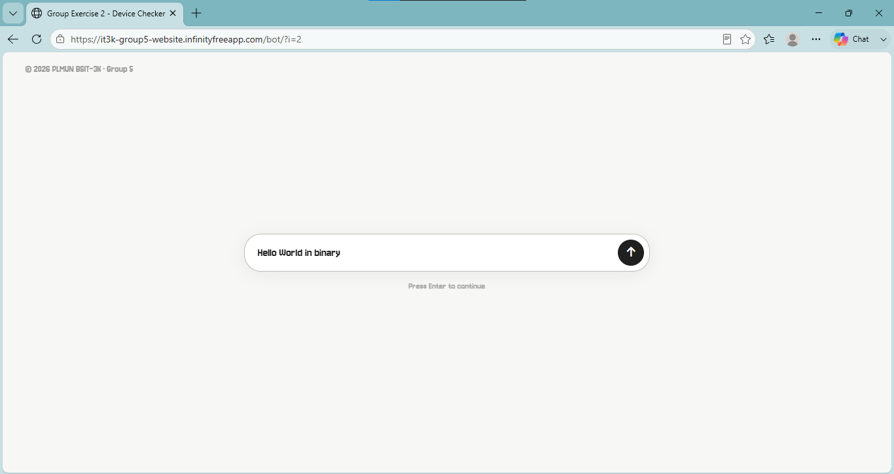
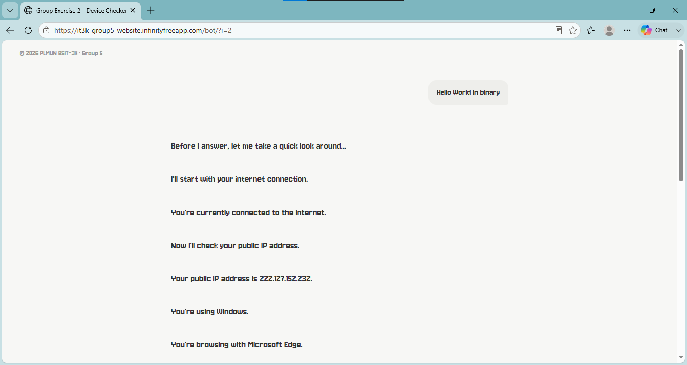

# Group Exercise #2 - Device Checker

Device checker is a simple one-page web application made using PHP, HTML, CSS, and JavaScript. It displays information about the user's browser and device, such as the internet connection, public IP address, operating system, browser, screen resolution, language, timezone, and webpage information

### Screenshots

#### Screenshot 1

#### Screenshot 2

### Live Website: https://it3k-group5-website.infinityfreeapp.com/device-checker/?i=2
